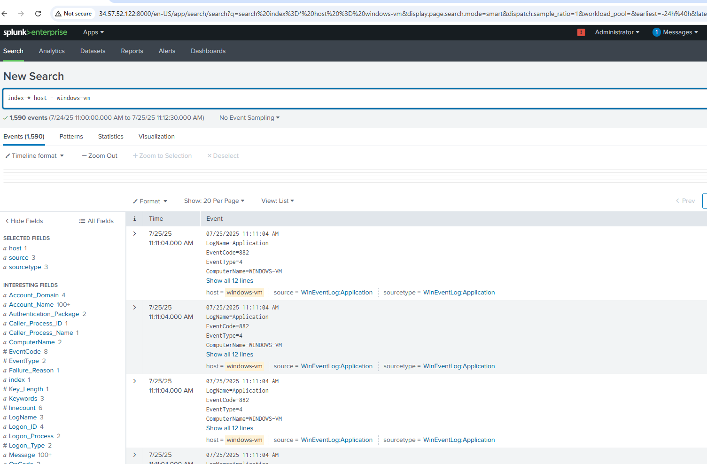
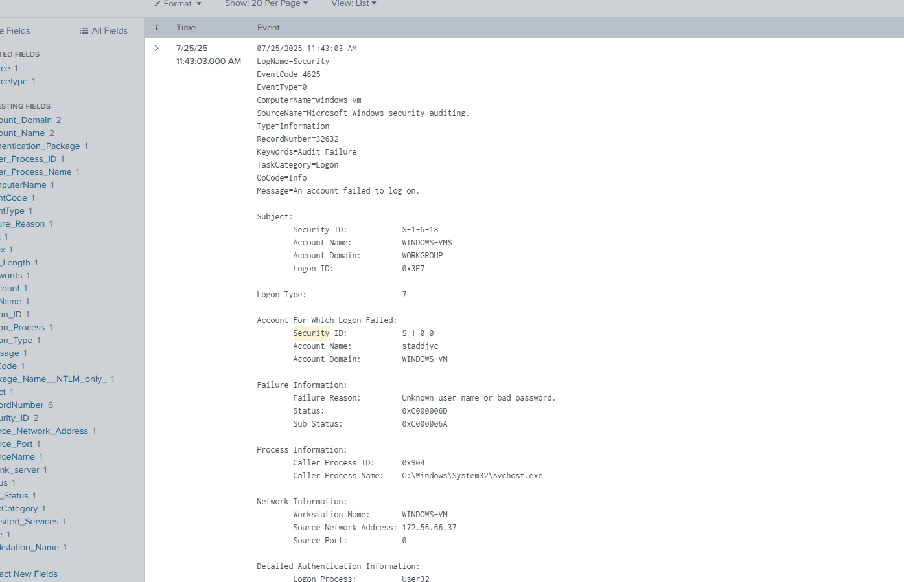

# 🔐 Splunk Blue Team Lab

This project demonstrates how to set up and monitor a basic blue team SIEM lab using Splunk. The goal is to detect suspicious activity such as failed login attempts and build hands-on detection experience using Sysmon logs, Windows event logs, and Splunk dashboards.

## 📁 Lab Environment

| Role           | IP Address    | Hostname     |
|----------------|---------------|--------------|
| SIEM (Splunk)  | 10.128.0.2    | staddjyc     |
| Windows VM     | 10.128.0.3    | windows-vm   |
| Attacker (Kali)| 10.128.0.4    | kali-box     |

## 🛠️ Tools Used

- Splunk Enterprise (on Ubuntu)
- Splunk Universal Forwarder
- Sysmon
- Windows Event Logs
- VirtualBox / VMware

## 🎯 Project Goals

- Detect failed login attempts using Event ID 4625
- Monitor user logon activity using Event ID 4624
- Create Splunk dashboards and alerts for suspicious activity
- Simulate attacks using Kali Linux and observe Splunk logs

## 🧪 Event Log Monitoring

Key Windows Event IDs monitored:

| Event ID | Description             |
|----------|-------------------------|
| 4624     | Successful logon        |
| 4625     | Failed logon            |
| 4798     | User account enumeration|

## 📸 Screenshot Example
Below is the first receiving logs

Below is a Splunk dashboard example showing detected failed login attempts.

## 📄 How to Reproduce

1. Set up Ubuntu with Splunk Enterprise at IP `10.128.0.2`.
2. Set up a Windows VM with Sysmon and Universal Forwarder at `10.128.0.3`.
3. Forward event logs to Splunk index.
4. Use Kali Linux (`10.128.0.4`) to generate attack simulations (e.g., brute force).
5. Search and visualize the logs in Splunk.

## 🧠 What I Learned

- How to configure Universal Forwarder and Sysmon for Windows log collection.
- Creating search queries in Splunk for common attacker behaviors.
- Building dashboards and alerts for blue team monitoring.

## 🙋 About Me

Hi, I’m **Staddjy**, a passionate cybersecurity learner working toward my Bachelor's in Information Technology. I’m CompTIA Network+ and Security+ certified, and I'm building hands-on skills in detection engineering and SIEM tools.

Connect with me on [LinkedIn](https://www.linkedin.com/in/carven-caze-168905174/)

---

